# Architecture Documentation
## AIOps Dashboard Project

This document describes the system architecture, components, data flow, and deployment structure of the AIOps Dashboard application.

---

## Table of Contents

1. [System Overview](#system-overview)
2. [High-Level Architecture](#high-level-architecture)
3. [Component Architecture](#component-architecture)
4. [Data Flow Diagrams](#data-flow-diagrams)
5. [Database Schema](#database-schema)
6. [Deployment Architecture](#deployment-architecture)
7. [Technology Stack](#technology-stack)

---

## System Overview

The AIOps Dashboard is a full-stack application for monitoring and forecasting server metrics. It consists of:

- **Backend API**: FastAPI-based REST API for data access and forecasting
- **Frontend UI**: Streamlit-based interactive dashboard
- **Database**: PostgreSQL for time-series metrics storage
- **Forecasting Engine**: Prophet-based time series forecasting
- **Authentication**: Keycloak integration (configured but not fully implemented)
- **Reverse Proxy**: Apache HTTPd for routing and SSL termination

---

## High-Level Architecture

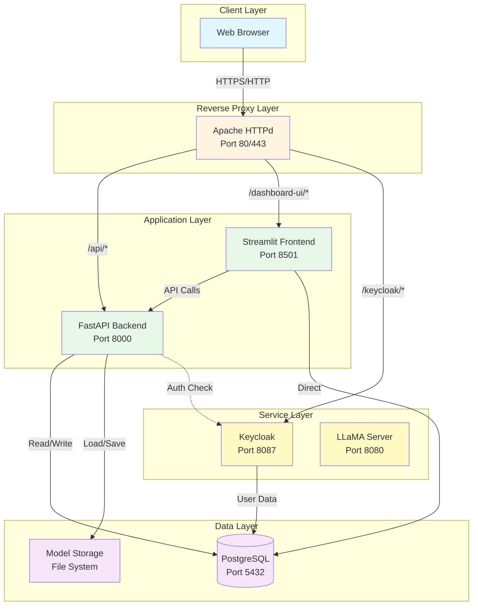

---

## Component Architecture

### Backend API Components

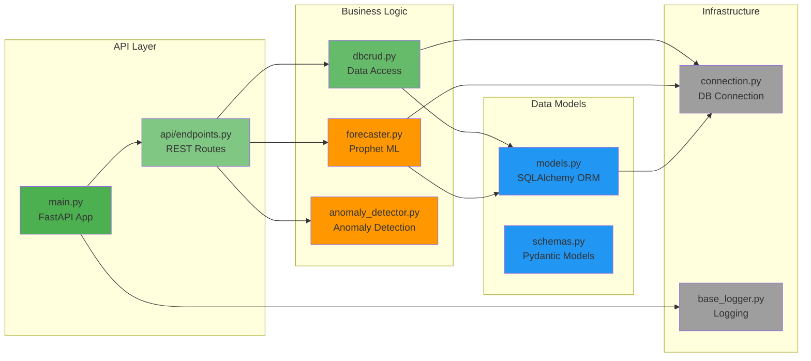

### Frontend UI Components

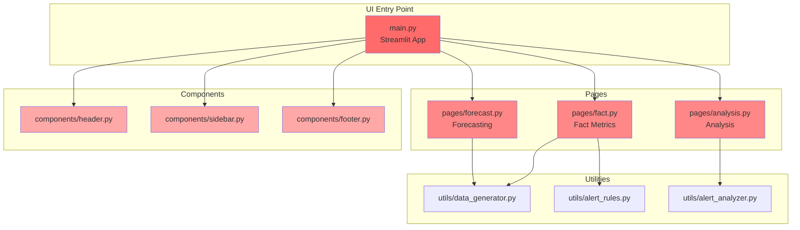

### Forecasting Module Components

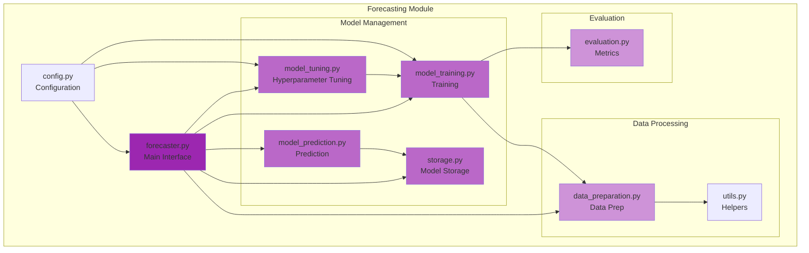

---

## Data Flow Diagrams

### Metrics Retrieval Flow

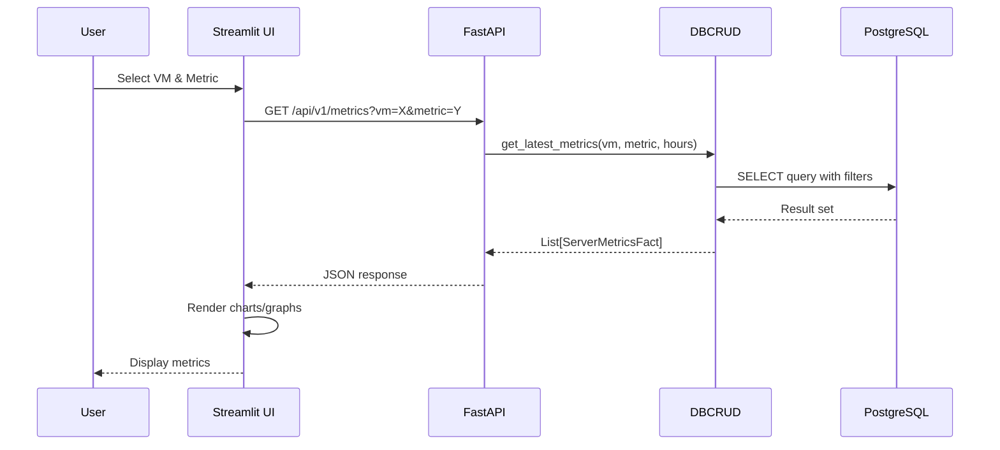

### Forecasting Flow

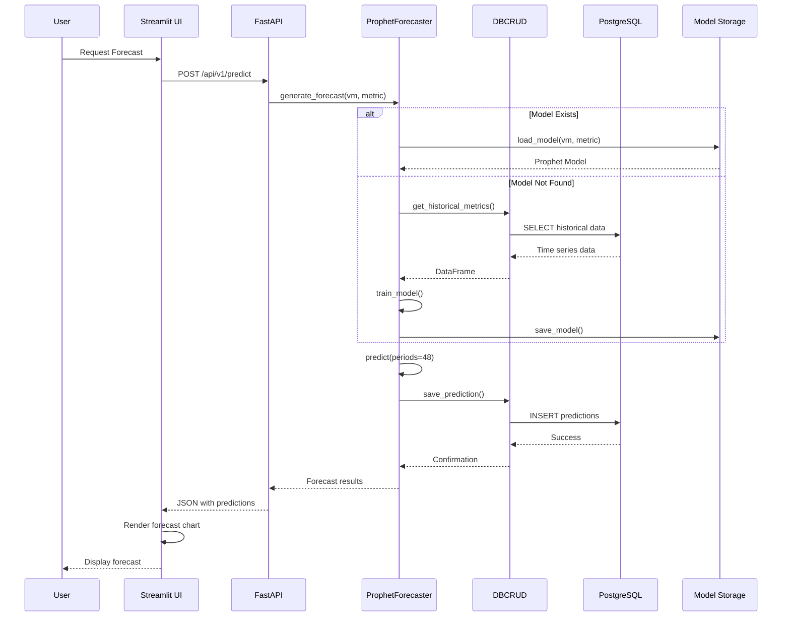

### Data Ingestion Flow

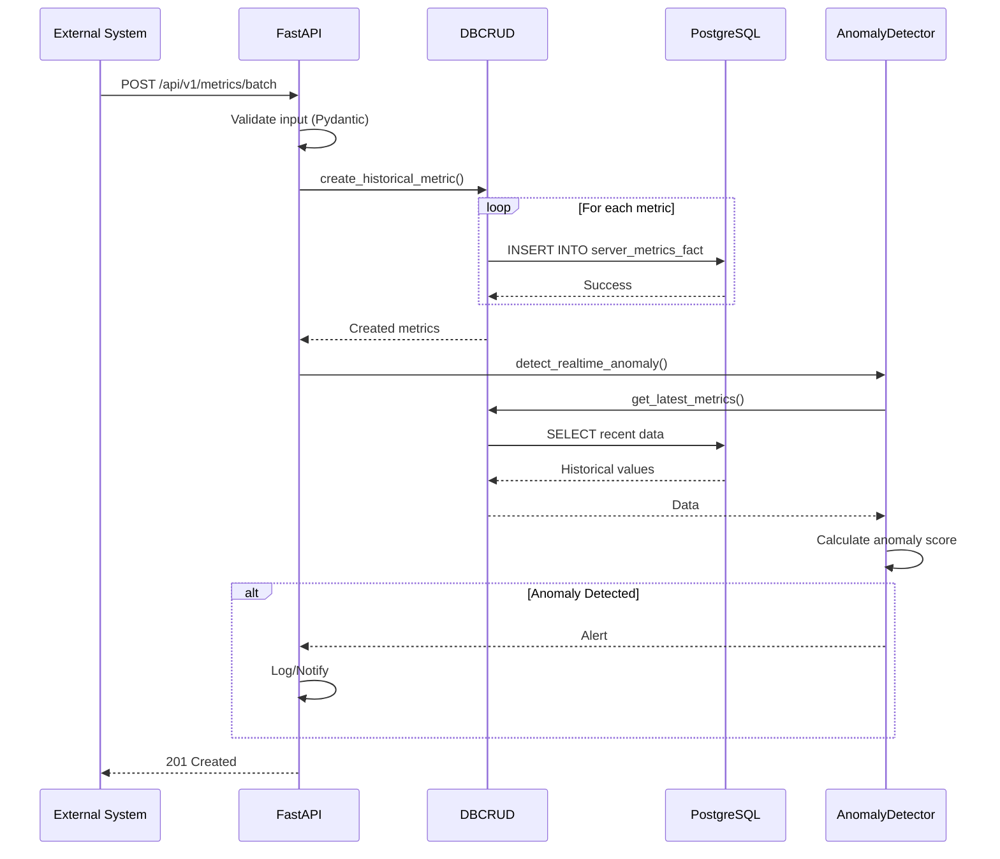

---

## Database Schema

### Entity Relationship Diagram

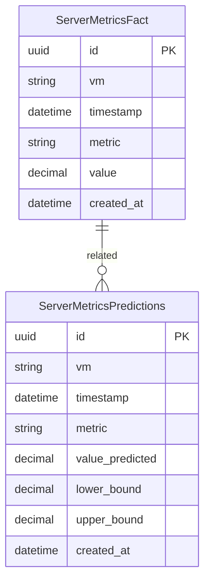

### Table Structure

#### server_metrics_fact
- **Purpose**: Stores actual/historical server metrics
- **Primary Key**: `id` (UUID)
- **Unique Constraint**: `(vm, timestamp, metric)`
- **Indexes**: 
  - `idx_vm_timestamp_metric` on `(vm, timestamp, metric)`
  - Individual indexes on `vm`, `timestamp`, `value`
- **Constraints**: 
  - `chk_timestamp_not_future`: Ensures timestamps are not in the future

#### server_metrics_predictions
- **Purpose**: Stores forecasted/predicted metrics
- **Primary Key**: `id` (UUID)
- **Unique Constraint**: `(vm, timestamp, metric)`
- **Indexes**: 
  - `idx_vm_timestamp_metric_pred` on `(vm, timestamp, metric)`
  - Individual indexes on `vm`, `timestamp`
- **Fields**: Includes confidence intervals (`lower_bound`, `upper_bound`)

---

## Deployment Architecture

### Docker Compose Deployment

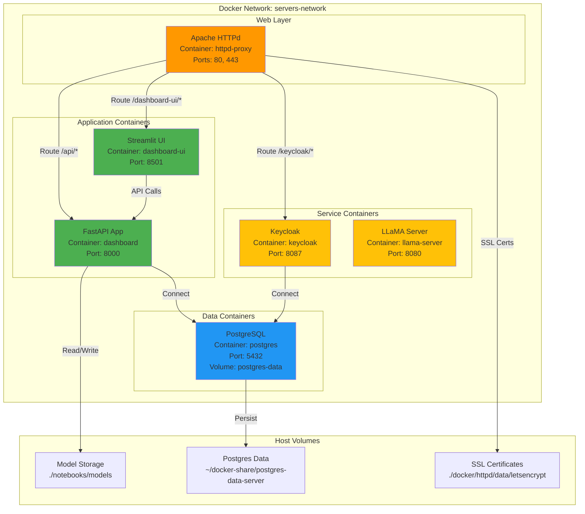

### Container Structure

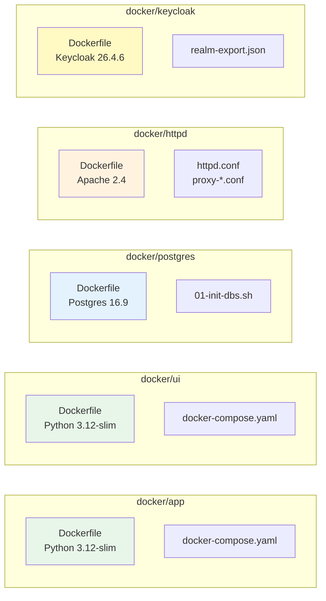

---

## Technology Stack

### Backend Stack
```
┌─────────────────────────────────────┐
│         FastAPI 0.104.1            │
│  - REST API Framework               │
│  - Async support                    │
│  - Auto-generated OpenAPI docs      │
└─────────────────────────────────────┘
           │
           ├─── SQLAlchemy 2.0.23
           │    - ORM for PostgreSQL
           │
           ├─── Pydantic 2.5.0
           │    - Data validation
           │
           ├─── Prophet 1.1.5
           │    - Time series forecasting
           │
           └─── Uvicorn 0.24.0
                - ASGI server
```

### Frontend Stack
```
┌─────────────────────────────────────┐
│      Streamlit 1.29.0               │
│  - Interactive dashboard             │
│  - Real-time updates                 │
└─────────────────────────────────────┘
           │
           ├─── Plotly 5.18.0
           │    - Interactive charts
           │
           ├─── Pandas 2.1.4
           │    - Data manipulation
           │
           └─── NumPy 1.26.2
                - Numerical operations
```

### Infrastructure Stack
```
┌─────────────────────────────────────┐
│         Docker & Docker Compose     │
│  - Containerization                  │
│  - Multi-service orchestration       │
└─────────────────────────────────────┘
           │
           ├─── PostgreSQL 16.9
           │    - Time-series database
           │
           ├─── Apache HTTPd 2.4
           │    - Reverse proxy
           │    - SSL termination
           │
           ├─── Keycloak 26.4.6
           │    - Identity management
           │
           └─── LLaMA Server
                - AI/ML capabilities
```

---

## Module Dependencies

### Backend Dependencies Graph

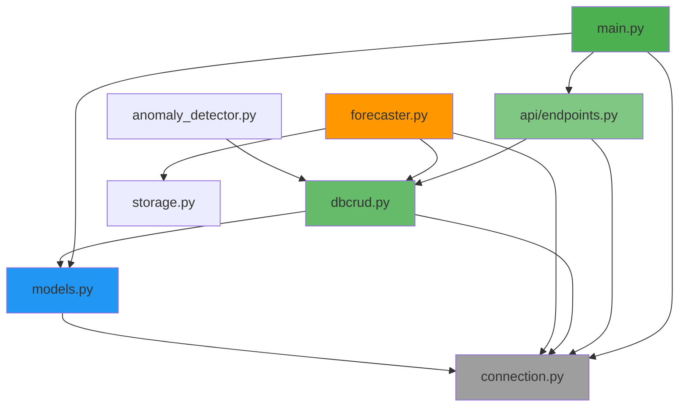

### Forecast Module Dependencies

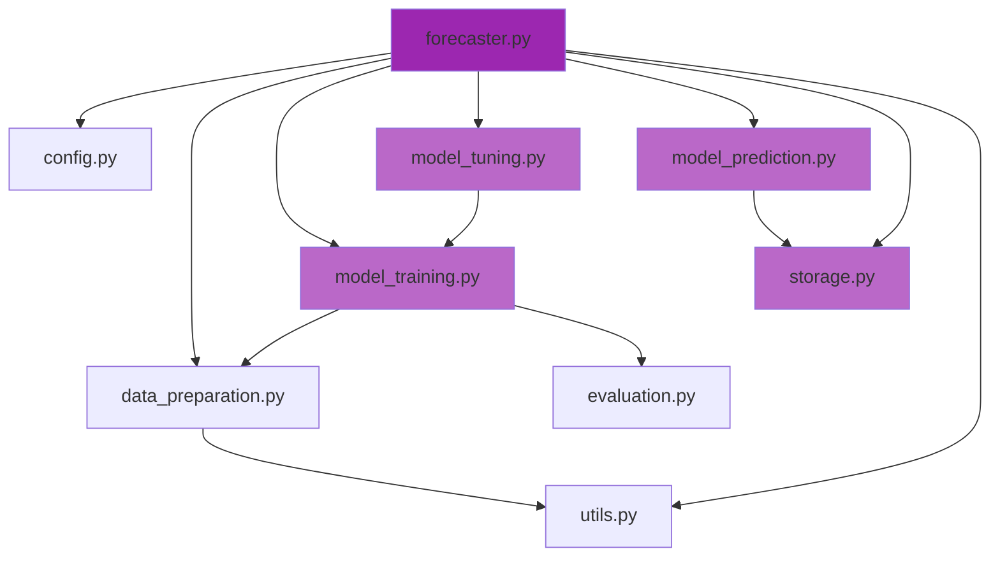

---

## API Endpoints Structure

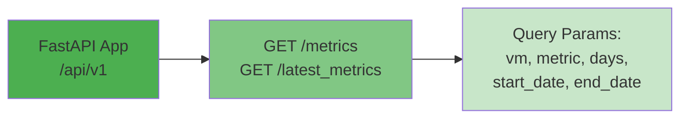

**Current Endpoints:**
- `GET /api/v1/latest_metrics` - Get latest 24 hours of metrics
- `GET /api/v1/metrics` - Get metrics with flexible date range

**Planned/Commented Endpoints:**
- `POST /api/v1/metrics/` - Create single metric
- `POST /api/v1/metrics/batch/` - Batch create metrics
- `POST /api/v1/predict/` - Generate forecast
- `POST /api/v1/train/` - Train model

---

## Data Processing Pipeline

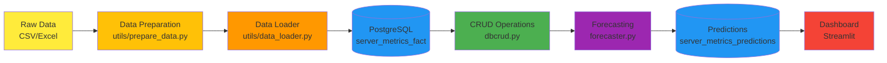

---

## Security Architecture (Planned)

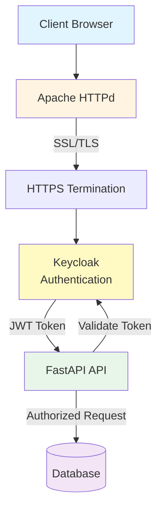

**Note:** Authentication is configured but not fully implemented in the current codebase.

---

## File Structure Overview

```
dashboard/
├── src/
│   ├── app/              # FastAPI Backend
│   │   ├── api/         # API endpoints
│   │   ├── models.py    # Database models
│   │   ├── schemas.py   # Pydantic schemas
│   │   ├── dbcrud.py    # Database operations
│   │   └── main.py      # FastAPI app
│   │
│   └── ui/              # Streamlit Frontend
│       ├── pages/       # Page components
│       ├── components/  # UI components
│       └── utils/       # UI utilities
│
├── forecast/            # Forecasting module
│   ├── forecaster.py    # Main interface
│   ├── model_training.py
│   ├── model_tuning.py
│   └── ...
│
├── docker/              # Docker configurations
│   ├── app/            # API container
│   ├── ui/             # UI container
│   ├── postgres/       # Database container
│   └── httpd/          # Reverse proxy
│
├── notebooks/          # Jupyter notebooks
└── data/              # Data files
    ├── source/        # Raw data
    └── processed/     # Processed data
```

---

## Performance Considerations

### Current Architecture
- **Synchronous database operations** (SQLAlchemy ORM)
- **No caching layer** (Redis/Memcached)
- **Direct database queries** from UI (should go through API)
- **File-based model storage** (could use object storage)

### Recommended Improvements
1. **Add Redis** for caching frequently accessed data
2. **Implement async database operations** (async SQLAlchemy)
3. **Add API gateway** for rate limiting
4. **Use object storage** (S3/MinIO) for model files
5. **Implement connection pooling** optimization
6. **Add database read replicas** for scaling

---

## Monitoring & Observability (Planned)

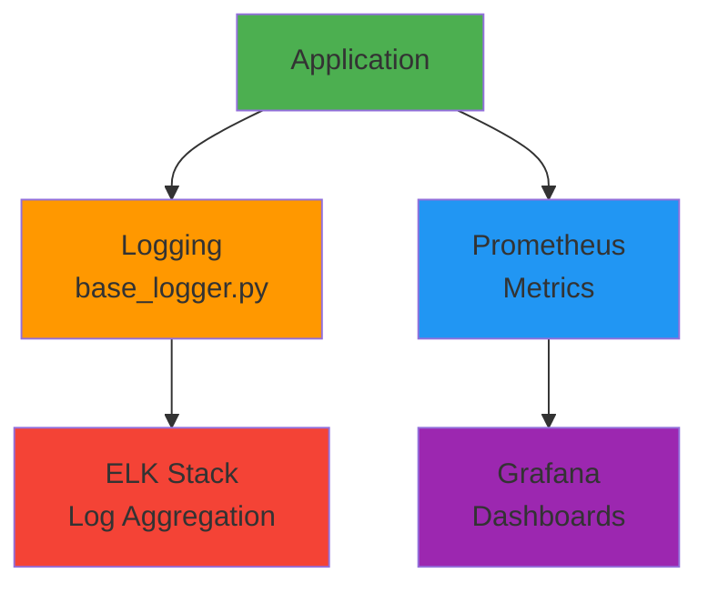

**Current State:**
- Basic file-based logging implemented
- No metrics collection
- No distributed tracing

---

## Conclusion

This architecture provides a solid foundation for an AIOps dashboard with time-series forecasting capabilities. The modular design allows for independent scaling of components and clear separation of concerns.

**Key Strengths:**
- Clear separation between frontend and backend
- Modular forecasting engine
- Containerized deployment
- Well-structured database schema

**Areas for Improvement:**
- Add caching layer
- Implement full authentication
- Add comprehensive monitoring
- Optimize for async operations
- Add API versioning

---

*Last Updated: 2025-01-27*

